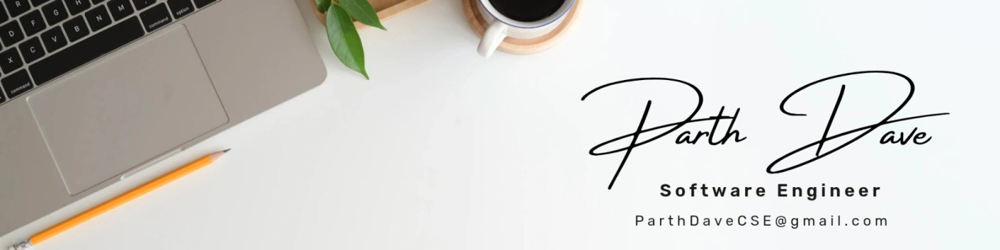

 

### 👋 Hi there, I'm Parth Dave!

---

# 💫 About Me:
🔭 I’m currently working on: Full-Stack development of my portfolio website "ParthDave.tech" 👯 I’m looking to collaborate on: Software Development Internships projects

## 🌐 Socials:
  

# 💻 Tech Stack:
                      

## 🛠️ Additional Technologies & Skills

### Frameworks & Libraries
- **PySerial** - Serial communication with hardware
- **Tkinter** - Python GUI development
- **AWS Services**: S3, CloudFront, ACM, Route 53, IAM

### Tools & Platforms
- **MySQL Workbench** - Database management
- **Chrome DevTools** - Web development debugging
- **Live Server** - VS Code extension for development

### Methodologies & Expertise
- 🧠 **Machine Learning & Deep Learning**
- 🎨 **Generative AI**
- 📊 **Data Science & Analysis**
- ⚡ **Real-time Data Processing**
- 🖥️ **GUI Development**
- 🔌 **Hardware Interfacing**
- 🔄 **SDLC Implementation**
- 🌐 **Responsive Web Design**
- ♿ **Web Accessibility (A11y)**
- 🖼️ **Image Optimization**

### Other Services
- 📈 **Google Analytics 4**
- 📝 **Third-party form services** (Formspree/FormSubmit)

# 📊 GitHub Stats:
 
 

# 📊 LeetCode Stats:

## 🏆 GitHub Trophies

---

[📚 **View Setup Guide**](GUIDE.md) - Learn how this profile was built!
- 
<!-- Proudly created with GPRM ( https://gprm.itsvg.in ) -->

<!--
**ParthDaveCSE/ParthDaveCSE** is a ✨ _special_ ✨ repository because its `README.md` (this file) appears on your GitHub profile.

Here are some ideas to get you started:

- 🔭 I’m currently working on ...
- 🌱 I’m currently learning ...
- 👯 I’m looking to collaborate on ...
- 🤔 I’m looking for help with ...
- 💬 Ask me about ...
- 📫 How to reach me: ...
- 😄 Pronouns: ...
- ⚡ Fun fact: ...
-->
